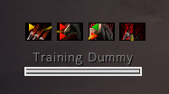
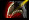
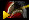
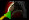
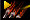
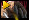

# Feral Snapshot Name Plate Indicators

This World of Warcraft Addon adds indicators to Blizzard Nameplates based on applied snapshots and current buffs.

Each bleed that can snapshot shows indicators on the current and next snapshots based on the player's current buffs. Use this to decide to overwrite a bleed with a stronger or weaker version.

## Indicators

The shape and color of the indicator compares the current snapshot to what would be applied if the bleed is overwritten.

| Indicator | Has Snapshot | Would apply snapshot| Power| Action |
|-----------|--------------|----------------------|------|-------|
|   | | | Equal | Gain snapshotting buff (Tiger's Fury, Shadowmeld, Bloodtalons) |
|  | X | X | Equal (buffed) | Reapply in pandemic window |
|  | | X | Gain | Reapply soon | 
|  | X | | Loss | Gain snapshotting buff or wait for expiration |

The lower indicator is for Tiger's Fury snapshots which applies to all Rake, Rip, Thrash and Moonfire with Lunar Inspiration.

## Upper Indicators

The upper indicator is for bleed specific snapshots like Stealth, Bloodtalons and Clear Casting with Moment of Clarity.

| Indicator | Buffs | Strength |
|-----------|-------|----------|
|  | Prowl, Sudden Ambush (Talented), Shadowmeld (Racial)| 160% |
|  | Bloodtalons (Talented) | 125% |
|  | Clear Casting (Moment of Clarity) | 115% |
